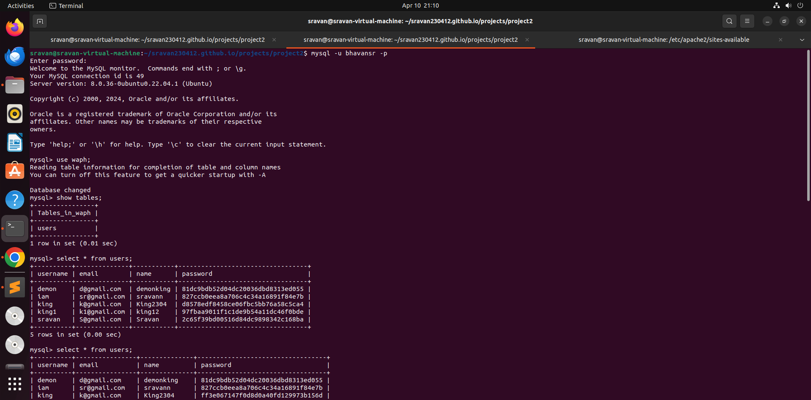
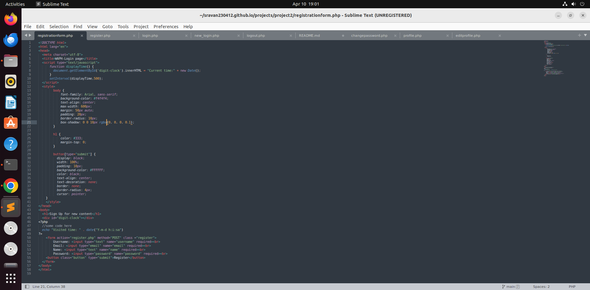
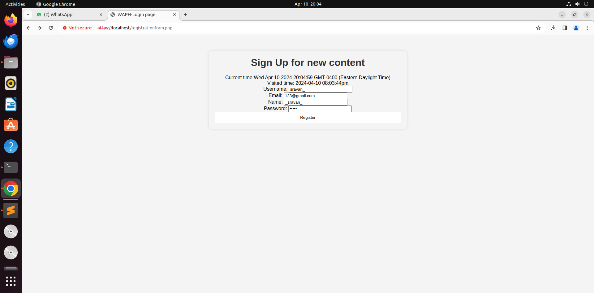
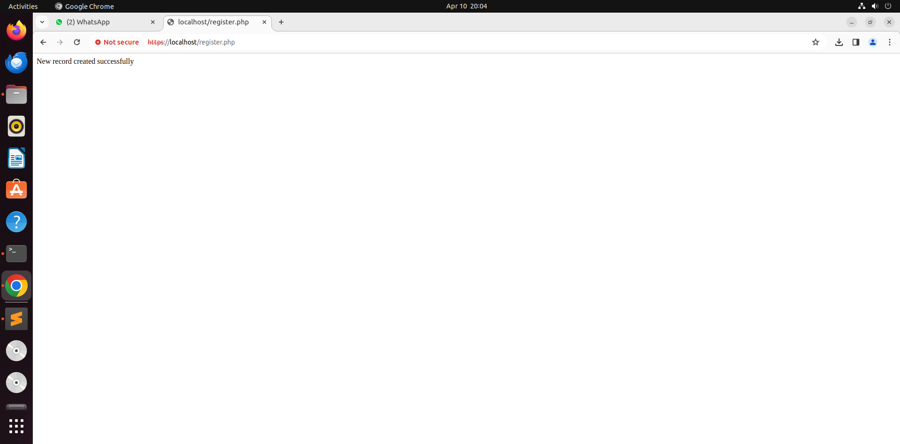
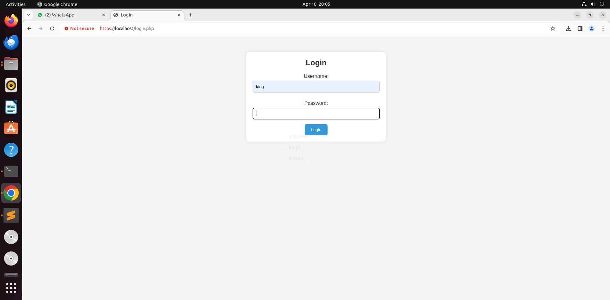
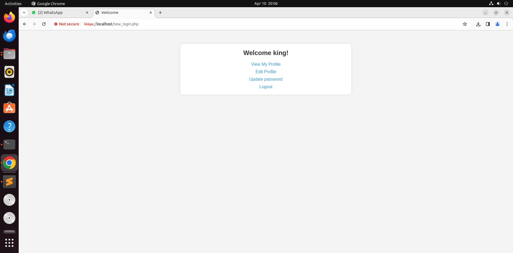
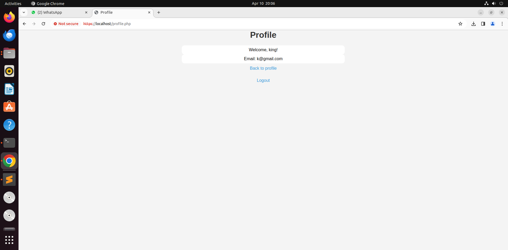
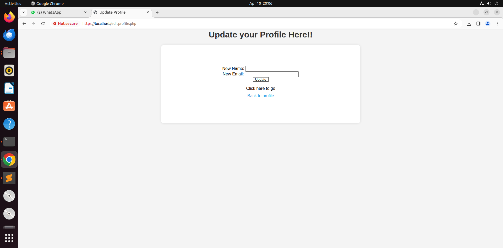
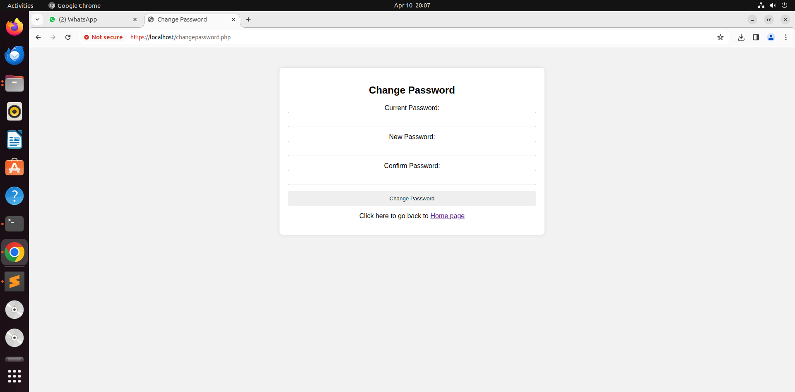
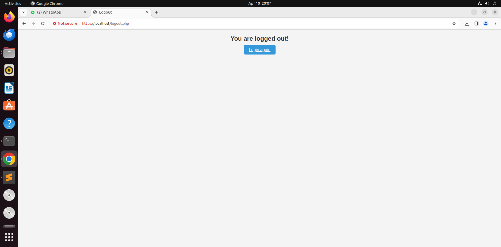

# WAPH-Web Application Programming and Hacking

## Instructor: Dr. Phu Phung

## Student

**Name** Sravan kumar Bhavana

**Email**: bhavansr@mail.uc.edu

**Short-bio**:I have keen interest to learn web applications and hacking.


## Repository Information

[https://github.com/sravan230412/sravan230412.github.io/tree/main](https://github.com/sravan230412/sravan230412.github.io/tree/main)

Direct link to Github repository: [https://github.com/sravan230412/sravan230412.github.io/tree/main/projects/project2](https://github.com/sravan230412/sravan230412.github.io/tree/main/projects/project2)

Demonstration video link: [https://mailuc-my.sharepoint.com/:v:/g/personal/bhavansr_mail_uc_edu/ES1XiWzqVRdHsq9ibFFJi6kBP08oWthr5UDeXW3RjOYjbg?e=dbj5Rl](https://mailuc-my.sharepoint.com/:v:/g/personal/bhavansr_mail_uc_edu/ES1XiWzqVRdHsq9ibFFJi6kBP08oWthr5UDeXW3RjOYjbg?e=dbj5Rl)


## Individual Project: 

# Overview

1. Gained the concept of user authorization and learned how to build up a login system to authenticate users and guard websites against hacking.

2. Interaction with databases: Acquired the knowledge to connect to a database, and run queries to obtain user information.

3. Session management: Learned how to keep users' logins on different websites by managing their sessions.

4. Data validation: learned how to confirm user input for data security and integrity.

5. User interface design: became proficient in the usage of HTML and CSS to create simple and intuitive web interfaces.

6. Password security: Learned how to securely handle and store passwords using techniques like hashing.

7. Error handling: learned how to handle problems and give users the right notifications.

8. Updating user data: Learned how to design forms that let users edit their profile information and put a mechanism in place to update the database accordingly.

9. Project workflow: I gained knowledge of the procedures involved in developing a web application, from designing the user interface to incorporating backend functionality.

### Setting up the requirements

## Registration

A database is created which collects and stores username, name, email and password with hased using registration form.



Registration form is displayed in the web browser to collect user registration process.





After storing the user's data the window shows the successful registration.



## Login 

A login page is created which fetches the data from the database to login the user.



# Profile or Home screen

After successful login the user is redirected to the home screen where user can edit, check their profile and change password.



# Checking user profile

In this user can check the details that he entered into the database details used for registration. The profile first analyses whether the user is logged in or not and if the user is logged in it fetches the database user's profile using username of the user. It then, displays the information.



# Editing profile

User can change the name, email of the which he used at the time of registration, he can update the data as per his need.



# Changing password

User can change the password by entering current, new passwords to change the password and then, the database is updated with the newpassword entered by the user.



Logout is to end the whole session of the login session, using session_destroy().



Appendix:
```php
<!DOCTYPE html>
<html lang="en">
<head>
  <meta charset="utf-8">
  <title>WAPH-Login page</title>
  <script type="text/javascript">
      function displayTime() {
        document.getElementById('digit-clock').innerHTML = "Current time:" + new Date();
      }
      setInterval(displayTime,500);
  </script>
  <style>
        body {
            font-family: Arial, sans-serif;
            background-color: #f4f4f4;
            text-align: center;
            max-width: 600px;
            margin: 50px auto;
            padding: 20px;
            border-radius: 10px;
            box-shadow: 0 0 10px rgba(0, 0, 0, 0.1);
        }

        h1 {
            color: #333;
            margin-top: 0;
        }

        button[type="submit"] {
          display: block;
          width: 100%;
          padding: 10px;
          background-color: #FFFFFF;
          color: black;
          text-align: center;
          text-decoration: none;
          border: none;
          border-radius: 4px;
          cursor: pointer;
    }
    </style>
</head>
<body>
  <h1>Sign Up for new content</h1>
  <div id="digit-clock"></div>  
<?php
  //some code here
  echo "Visited time: " . date("Y-m-d h:i:sa")
?>
    <form action="register.php" method="POST" class ="register">
        Username: <input type="text" name="username" required><br>
        Email: <input type="email" name="email" required><br>
        Name: <input type="text" name="name" required><br>
        Password: <input type="password" name="password" required><br>
    <button class="button" type="submit">Register</button>
  </form>
</body>
</html>

<?php
// Database configuration
$servername = "localhost";
$username = "bhavansr";
$password = "12345";
$dbname = "waph";

ini_set('display_errors', 1);
ini_set('display_startup_errors', 1);
error_reporting(E_ALL);

// Create database connection
$conn = new mysqli($servername, $username, $password, $dbname);

// Check connection
if ($conn->connect_error) {
    die("Connection failed: " . $conn->connect_error);
}

// Capture form data
$username = $_POST['username'];
$email = $_POST['email'];
$name = $_POST['name'];
$password = $_POST['password'];
// Assuming you've hashed the password for security purposes
$hashed_password = password_hash($password, PASSWORD_DEFAULT);

// Insert user data into the database
$sql = "INSERT INTO users (username, email, name, password)
VALUES ('$username', '$email', '$name', $password, '$hashed_password')";

// Using prepared statement to avoid SQL injection
$stmt = $conn->prepare("INSERT INTO users (username, email, name, password) VALUES (?, ?, ?, md5(?))");

// Bind parameters: 's' specifies the parameter type => 'string'
$stmt->bind_param("ssss", $username, $email, $name, $password);


if ($stmt->execute()) {
    echo "New record created successfully";
} else {
    echo "Error: " . $stmt->error;
}

$stmt->close();
$conn->close();

?>

<!DOCTYPE html>
<html lang="en">
<head>
    <meta charset="UTF-8">
    <meta name="viewport" content="width=device-width, initial-scale=1.0">
    <title>Login</title>
    <style>
        body {
            font-family: Arial, sans-serif;
            background-color: #f4f4f4;
            margin: 0;
            padding: 0;
        }

        .container {
            max-width: 400px;
            margin: 50px auto;
            padding: 20px;
            background-color: #fff;
            border-radius: 10px;
            box-shadow: 0 0 10px rgba(0, 0, 0, 0.1);
            text-align: center;
        }

        h2 {
            color: #333;
            margin-top: 0;
        }

        label {
            display: block;
            margin-top: 10px;
            color: #333;
        }

        input[type="text"],
        input[type="password"] {
            width: 100%;
            padding: 10px;
            margin-top: 5px;
            margin-bottom: 15px;
            border: 1px solid #ccc;
            border-radius: 5px;
            box-sizing: border-box;
        }

        button {
            background-color: #3498db;
            color: #fff;
            padding: 10px 20px;
            border: none;
            border-radius: 5px;
            cursor: pointer;
        }

        button:hover {
            background-color: #2980b9;
        }
    </style>
</head>
<body>

<div class="container">
    <h2>Login</h2>
    <form action="new_login.php" method="post">
        <div>
            <label for="username">Username:</label>
            <input type="text" id="username" name="username" required>
        </div>
        <div>
            <label for="password">Password:</label>
            <input type="password" id="password" name="password" required>
        </div>
        <button type="submit">Login</button>
    </form>
</div>

</body>
</html>

<?php
session_start();

if(isset($_POST["username"]) and isset($_POST["password"])) {
    if (checklogin_mysql($_POST["username"], $_POST["password"]) || checklogin_email($_POST["username"], $_POST["password"])) {
        $_SESSION["authenticated"] = TRUE;
        $_SESSION["username"] = $_POST["username"];
        $_SESSION["browser"] = $_SERVER["HTTP_USER_AGENT"];
    } else {
        session_destroy();
        echo "<script>alert('Invalid username/password');window.location='login.php';</script>";
        die();
    }
}

if(!$_SESSION["authenticated"] or $_SESSION["authenticated"] != TRUE){
    session_destroy();
    echo "<script>alert('You have not Login. Please login first ');</script>";
    header("Refresh:0; url=login.php");
    die();
}

if($_SESSION["browser"] != $_SERVER["HTTP_USER_AGENT"]){
    session_destroy();
    echo "<script>alert('Session Hijacking attack is detected!');</script>";
    header("Refresh:0; url=login.php");
    die();
}

function checklogin_mysql($username, $password) {
    $mysqli = new mysqli('localhost','bhavansr','12345','waph');
    if($mysqli->connect_errno){
        printf("Database connection failed: %s\n", $mysqli->connect_error);
        exit();
    }

    $sql = "SELECT * FROM users WHERE username=?  AND password = md5(?)";
    $stmt = $mysqli->prepare($sql);
    $stmt->bind_param("ss", $username, $password);
    $stmt->execute();
    $result = $stmt->get_result();
    if($result->num_rows == 1)
        return TRUE;
    return FALSE;
}

function checklogin_email($email, $password) {
    $mysqli = new mysqli('localhost','bhavansr','12345','waph');
    if($mysqli->connect_errno){
        printf("Database connection failed: %s\n", $mysqli->connect_error);
        exit();
    }

    $sql = "SELECT * FROM users WHERE email=?  AND password = md5(?)";
    $stmt = $mysqli->prepare($sql);
    $stmt->bind_param("ss", $email, $password);
    $stmt->execute();
    $result = $stmt->get_result();
    if($result->num_rows == 1)
        return TRUE;
    return FALSE;
}

// Retrieve user's profile information
function getUserProfile($username) {
    $mysqli = new mysqli('localhost','bhavansr','12345','waph');
    if($mysqli->connect_errno){
        printf("Database connection failed: %s\n", $mysqli->connect_error);
        exit();
    }

    $sql = "SELECT * FROM users WHERE username=?";
    $stmt = $mysqli->prepare($sql);
    $stmt->bind_param("s", $username);
    $stmt->execute();
    $result = $stmt->get_result();
    $userProfile = $result->fetch_assoc();
    return $userProfile;
}

$userProfile = getUserProfile($_SESSION['username']);
?>

<!DOCTYPE html>
<html lang="en">
<head>
    <meta charset="UTF-8">
    <meta name="viewport" content="width=device-width, initial-scale=1.0">
    <title>Welcome</title>
    <style>
        body {
            font-family: Arial, sans-serif;
            background-color: #f4f4f4;
            margin: 0;
            padding: 0;
        }

        .container {
            max-width: 600px;
            margin: 50px auto;
            padding: 20px;
            background-color: #fff;
            border-radius: 10px;
            box-shadow: 0 0 10px rgba(0, 0, 0, 0.1);
            text-align: center;
        }

        h2 {
            color: #333;
            margin-top: 0;
        }

        a {
            display: block;
            margin-top: 10px;
            color: #3498db;
            text-decoration: none;
        }

        a:hover {
            text-decoration: underline;
        }
    </style>
</head>
<body>

<div class="container">
    <h2>Welcome <?php echo htmlentities($_SESSION['username']); ?>!</h2>
    <a href="profile.php">View My Profile</a>
    <a href="editprofile.php">Edit Profile</a>
    <a href="changepassword.php">Update password</a>
    <a href="logout.php">Logout</a>
</div>

</body>
</html>

<?php
	session_start();
	session_destroy();
?>
<!DOCTYPE html>
<html lang="en">
<head>
    <meta charset="UTF-8">
    <meta name="viewport" content="width=device-width, initial-scale=1.0">
    <title>Logout</title>
    <style>
        body {
            font-family: Arial, sans-serif;
            background-color: #f4f4f4;
            margin: 20px auto;
            padding: 0;
            text-align: center;
            display: center;
        }


        h2 {
            color: #333;
            margin-top: 0;
        }
        a{
            background-color: #3498db;
            color: #fff;
            padding: 10px 20px;
            border: none;
            border-radius: 5px;
            cursor: pointer;
        }

        a:hover {
            background-color: #2980b9;
        }
    </style>
</head>
<body>
		<h2>You are logged out! </h2>
		<a href="login.php"> Login again</a>
</body>
</html>


<?php
session_start();

// Check if user is not logged in
if (!isset($_SESSION["authenticated"]) || $_SESSION["authenticated"] !== TRUE) {
    echo "<script>alert('Not authorized. Please login first.'); window.location='login.php';</script>";
    exit; // Stop further execution
}

if(isset($_POST["current_password"]) && isset($_POST["new_password"]) && isset($_POST["confirm_password"])) {
    $username = $_SESSION["username"];
    $currentPassword = $_POST["current_password"];
    $newPassword = $_POST["new_password"];
    $confirmPassword = $_POST["confirm_password"];

    if($newPassword != $confirmPassword) {
        echo "<script>alert('New password and confirm password do not match');</script>";
    } else {
        if(changePassword($username, $currentPassword, $newPassword)) {
            echo "<script>alert('Password changed successfully');</script>";
        } else {
            echo "<script>alert('Failed to change password');</script>";
        }
    }
}

function changePassword($username, $currentPassword, $newPassword) {
    $mysqli = new mysqli('localhost', 'bhavansr', '12345', 'waph');
    if($mysqli->connect_errno){
        printf("Database connection failed: %s\n", $mysqli->connect_error);
        return FALSE;
    }

    $sql = "UPDATE users SET password = MD5(?) WHERE username = ? AND password = MD5(?)";
    $stmt = $mysqli->prepare($sql);
    $stmt->bind_param("sss", $newPassword, $username, $currentPassword);
    if($stmt->execute() && $stmt->affected_rows > 0) {
        return TRUE;
    } else {
        return FALSE;
    }
}
?>

<!DOCTYPE html>
<html lang="en">
<head>
  <meta charset="UTF-8">
  <title>Change Password</title>
  <style>
    body {
      font-family: Arial, sans-serif;
      background-color: #f2f2f2;
      margin: 0;
      padding: 0;
    }
    .container {
      max-width: 600px;
      margin: 50px auto;
      padding: 20px;
      background-color: #fff;
      border-radius: 8px;
      box-shadow: 0 0 10px rgba(0, 0, 0, 0.1);
      text-align: center;
    }
    h2, label {
      text-align: center;
    }
    input[type="password"] {
      width: 100%;
      padding: 10px;
      margin-bottom: 15px;
      border: 1px solid #ccc;
      border-radius: 4px;
      box-sizing: border-box;
    }
    button[type="submit"] {
      display: block;
      width: 100%;
      padding: 10px;
      background-color: #GFA876;
      color: black;
      text-align: center;
      text-decoration: none;
      border: none;
      border-radius: 4px;
      cursor: pointer;
    }
    button[type="submit"]:hover {
      background-color: #45a049;
    }
  </style>
</head>
<body>
  <div class="container">
    <h2>Change Password</h2>
    <form action="" method="POST" onsubmit="return validateForm()">
      <label for="current_password">Current Password:</label>
      <input type="password" id="current_password" name="current_password" required><br>
      <input type="hidden" class="text_field" name="nocsrftoken" value="<?php echo $rand; ?>"/>
      
      <label for="new_password">New Password:</label>
      <input type="password" id="new_password" name="new_password" required
             pattern="^(?=.*[a-z])(?=.*[A-Z])(?=.*[0-9])(?=.*[!@#$%^&])[\w!@#$%^&]{8,}$"
             title="Password must have at least 8 characters with 1 special symbol !@#$%^& 1 number, 1 lowercase, and 1 UPPERCASE"
             onchange="this.setCustomValidity(this.validity.patternMismatch ? this.title : '');"><br>

      <label for="confirm_password">Confirm Password:</label>
      <input type="password" id="confirm_password" name="confirm_password" required
             onchange="this.setCustomValidity(this.validity.patternMismatch ? 'Password does not match' : '');"><br>

      <button type="submit">Change Password</button>

      <p> Click here to go back to <a href="new_login.php">Home page</a></p>
    </form>
  </div>

  <script type="text/javascript">
    function validateForm() {
      var newPassword = document.getElementById("new_password").value;
      var confirmPassword = document.getElementById("confirm_password").value;

      if (newPassword !== confirmPassword) {
        alert("New password and confirm password do not match");
        return false;
      }

      return true;
    }
  </script>
</body>
</html>

<?php
session_start();

// Check if user is logged in
if (!isset($_SESSION['username'])) {
    header("Location: login.php");
    //win32_continue_service("profile.php");
    exit;}
//}
ini_set('display_errors', 1);
ini_set('display_startup_errors', 1);
error_reporting(E_ALL);


// Database connection
$servername = "localhost";
$username = "bhavansr"; // Your MySQL username
$password = "12345"; // Your MySQL password
$dbname = "waph"; // Your database name

// Create connection
$conn = new mysqli($servername, $username, $password, $dbname);

// Check connection
if ($conn->connect_error) {
    die("Connection failed: " . $conn->connect_error);
}

// Fetch user data
$username = $_SESSION['username'];
$sql = "SELECT * FROM users WHERE username='$username'";
$result = $conn->query($sql);

if ($result) {
    if ($result->num_rows > 0) {
        $user = $result->fetch_assoc();
    } else {
        $error = "No user data found for username: $username";
    }
} else {
    $error = "Error fetching user data: " . $conn->error;
}

$conn->close();
?>

<!DOCTYPE html>
<html lang="en">
<head>
    <meta charset="UTF-8">
    <meta name="viewport" content="width=device-width, initial-scale=1.0">
    <title>Profile</title>
    <style>
        body {
            font-family: Arial, sans-serif;
            background-color: #f4f4f4;
            margin: 0;
            padding: 0;
        }

        p {
            max-width: 600px;
            margin: 0 auto;
            padding: 8px;
            background-color: #fff;
            border-radius: 10px;
            text-align: center;
        }

        h1 {
            color: #333;
            margin-top: 0;
            text-align: center;
        }

        a {
            display: block;
            margin-top: 10px;
            color: #3498db;
            text-decoration: none;
            text-align: center;
        }

        a:hover {
            text-decoration: underline;
        }
    </style>
</head>
<body>
    <h1>Profile</h1>
    <?php if (isset($error)): ?>
        <p><?php echo $error; ?></p>
    <?php elseif (isset($user) && isset($user['username'])): ?>
        <p>Welcome, <?php echo $user['username']; ?>!</p>
        <p>Email: <?php echo $user['email']; ?></p>
        <!-- Display other user profile information here -->
    <?php else: ?>
        <p>Error: User data is not available.</p>
    <?php endif; ?>
    <a href="new_login.php">Back to profile</a> <br>
    <a href="logout.php">Logout</a>
</body>
</html>

<?php
session_start();


// Check if user is logged in
if (!isset($_SESSION['authenticated'])|| $_SESSION['authenticated'] !== TRUE) {
    header("Location: login.php");
    exit;
}

$userProfile = getUserProfile($_SESSION['username']);

// Update user details if form is submitted
if ($_SERVER["REQUEST_METHOD"] == "POST") {
    $_SESSION['authenticated'] = TRUE;
    $newUsername = $_POST["username"];
    $newEmail = $_POST["email"];

    if (updateUserDetails($_SESSION['username'], $newUsername, $newEmail)) {
        echo "<script>alert('User details updated successfully');</script>";
        // Update session username if changed
        $_SESSION['username'] = $newUsername;
        // Refresh user profile after update
        $userProfile = getUserProfile($_SESSION['username']);
    } else {
        echo "<script>alert('Failed to update user details');</script>";
    }
}

function getUserProfile($username) {
    $mysqli = new mysqli('localhost', 'bhavansr', '12345', 'waph');
    if ($mysqli->connect_errno) {
        printf("Database connection failed: %s\n", $mysqli->connect_error);
        exit();
    }

    $sql = "SELECT * FROM users WHERE username=?";
    $stmt = $mysqli->prepare($sql);
    $stmt->bind_param("s", $username);
    $stmt->execute();
    $result = $stmt->get_result();
    $userProfile = $result->fetch_assoc();
    return $userProfile;
}

function updateUserDetails($username, $newUsername, $newEmail) {
    $mysqli = new mysqli('localhost', 'bhavansr', '12345', 'waph');
    if ($mysqli->connect_errno) {
        printf("Database connection failed: %s\n", $mysqli->connect_error);
        return FALSE;
    }
    if ($_SERVER["REQUEST_METHOD"] == "POST") {
        $newName = $_POST['name'];
        $newEmail = $_POST['email'];

    // Validate 'name' field
     if (empty($newName)) {
        echo "Name field cannot be empty.";
        exit;
    }

    // Update user profile in the database
    $stmt = $mysqli->prepare("UPDATE users SET name = ?, email = ? WHERE username = ?");
    $stmt->bind_param("sss", $newName, $newEmail, $_SESSION['username']);
    $stmt->execute();
    $stmt->close();

    // Redirect to profile page
    header("Location: profile.php");
    } else {
        return FALSE;
    }
}
?>

<!DOCTYPE html>
<html lang="en">
<head>
    <meta charset="UTF-8">
    <meta name="viewport" content="width=device-width, initial-scale=1.0">
    <title>Update Profile</title>
    <style>
        body {
            font-family: Arial, sans-serif;
            background-color: #f4f4f4;
            margin: 0;
            padding: 0;
        }

        form {
            max-width: 600px;
            margin: 10px auto;
            padding: 80px;
            background-color: #fff;
            border-radius: 10px;
            box-sizing: 10px;
            box-shadow: 0 0 10px rgba(0, 0, 0, 0.1);
            text-align: center;
            display: run-in;
        }

        h1 {
            color: #333;
            margin-top: 0;
            text-align: center;
        }

        a {
            display: block;
            margin-top: 10px;
            color: #3498db;
            text-decoration: none;
        }

        a:hover {
            text-decoration: underline;
        }
        button[type="submit"] {
          width: 10%;
          padding: 0px;
          color: black;
          text-align: center;
          background-color: white;
    }
    </style>
</head>
<body>
    <h1>Update your Profile Here!!</h1>
    <form  method="post">
        <div>
            <label for="name">New Name:</label>
            <input type="text" id="name" name="name" value="<?php echo htmlspecialchars($name); ?>" required>
        </div>
        <div>
            <label for="email">New Email:</label>
            <input type="email" id="email" name="email" value="<?php echo htmlspecialchars($email); ?>" required>
        </div>
        <button type="submit">Update</button>
       <p>Click here to go <a href="new_login.php">Back to profile</a></p>
    </form>
</body>
</html>
```